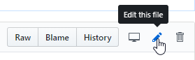
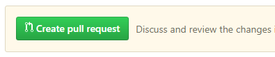

# Bienvenue dans l'Encyclopédie du making

L'Encyclopédie aborde la création RPG Maker sous tous ses aspects, en tant que pratique créative mais aussi en tant que culture. Vous y trouverez des guides pour utiliser le logiciel, ainsi que des renseignements sur la communauté et ses jeux.

Nous souhaitons en faire **une mine d'informations facile à explorer** pour tous les amateurs du logiciel, à tous les niveaux !

Si l'idée vous plaît, vous pouvez étoffer les pages existantes ou en ajouter de nouvelles. Si vous souhaitez contribuer mais ne savez pas par quoi commencer, vous pouvez parcourir la [liste des issues](https://github.com/rpgmakeralliance/wiki/issues) pour trouver de l'inspiration, ou demander aux gens ce qu'ils aimeraient bien lire.

RMA assurera la perrénité du site et de ses précieuses informations : votre contribution ne sera pas perdue dans les méandres d'Internet. Si vous le souhaitez, vous pouvez également télécharger votre propre copie des fichiers source. Le contenu des articles est sous licence [CC BY-NC-SA 4.0](https://creativecommons.org/licenses/by-nc-sa/4.0/), et [le thème](https://github.com/rpgmakeralliance/wiki/tree/master/royal_theme) est sous [licence MIT](https://github.com/rpgmakeralliance/wiki/blob/master/royal_theme/LICENSE). Pour plus de renseignements à ce sujet, contactez-nous sur [Discord](https://discord.gg/RrBppaj).

# Contribuer à l'Encyclopédie

## Modifier une page existante

Vous souhaitez ajouter un paragraphe, ou même tout simplement corriger une faute ? Il vous suffit d'ouvrir le fichier .rst dans la liste ci-dessus, ou de cliquer sur *Modifier cette page* depuis le wiki. Ensuite, cliquez ici :

Vous devez posséder un compte GitHub, [créez-en un ici](https://github.com/join). Grâce au compte, vos modifications sont uniquement enregistrées chez vous, donc **vous pouvez faire des erreurs sans crainte.** Nous les corrigerons avant d'accepter votre proposition.

Ici, écrivez un ou deux mots pour résumer vos changements, et validez. :slight_smile: 

Vous arrivez sur une page récapitulant vos ajouts et suppressions. Si cela vous convient, créez une pull request.

Et voilà ! Un modérateur vérifiera votre pull request avant de la valider. Merci pour votre contribution !

## Modifier en profondeur

Les pages du wiki sont mises en forme avec reStructuredText. Vous comprendrez facilement la syntaxe en vous inspirant des fichiers déjà créés, et en consultant un guide. Voici une [référence rapide](http://docutils.sourceforge.net/docs/user/rst/quickref.html), et pour aller plus loin, voici la [documentation complète](http://www.sphinx-doc.org/en/master/usage/restructuredtext/index.html) incluant les fonctionnalités supplémentaires de Sphinx, qui est l'outil que nous utilisons pour générer le wiki.

1. Sur Github, cliquez sur le bouton **Fork** en haut de la page. Cela créera une copie de l'état actuel de `rpgmakeralliance/wiki` sur votre propre profil Github.

2. Vous pouvez maintenant éditer librement votre fork. Utilisez directement l'éditeur en ligne, ou téléchargez les fichiers avec [Github Desktop](https://desktop.github.com/) pour utiliser votre éditeur de texte favori.

3. Une fois que vous avez terminé vos modifications, allez sur la page de votre fork, et cliquez sur **Pull request**. Une requête pour fusionner votre fork et `rpgmakeralliance/wiki` nous sera envoyée, et nous devrons confirmer la fusion (*merge*).

Si vous désirez faire des changements à votre pull request avant que nous ne l'acceptions, modifiez simplement vos fichiers comme vous le faisiez jusqu'à présent. La pull request va automatiquement prendre en compte les changements.

Si vous êtes perdu·e, n'hésitez pas à [demander de l'aide sur Discord](https://discord.gg/RrBppaj), il y aura toujours quelqu'un pour vous aider.
