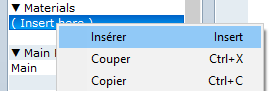

.. meta::
   :description: Découvrez comment installer des scripts pour ajouter de nouvelles fonctionnalités à vos jeux RPG Maker, sans savoir programmer.

.. _installerunscript:

Installer un script
===================

De nombreux programmeurs écrivent des scripts pour les publier en accès libre sur Internet. C'est un moyen simple et rapide d'ajouter des fonctionnalités avancées à vos jeux, sans savoir programmer.

RPG Maker MV
------------

Les scripts sont écrits en JavaScript, et partagés sous forme de plugins. Ce sont des fichiers à télécharger au format js.

Ouvrez le dossier de votre jeu. Naviguez jusqu'au dossier ``js/plugins`` puis copiez-y le fichier js.

Retournez dans RPG Maker MV et cliquez sur l'icône de pièce de puzzle pour ouvrir le gestionnaire de plugins. Double-cliquez sur un espace vide, puis choisissez votre plugin dans le menu déroulant. Ajustez les options s'il y en a, puis sauvegardez vos changements.

RPG Maker VX Ace et antérieur
-----------------------------

La plupart du temps, les scripts ne sont pas compatibles d'une version de RPG Maker à l'autre. Assurez-vous que le script désiré soit écrit pour votre version.

Les scripts sont écrits en Ruby. Il n'est pas nécessaire de télécharger un fichier : il suffit de copier-coller le code.

   L'éditeur de script peut aussi être ouvert avec F11.

Sélectionnez le contenu du script et copiez-le. Retournez dans RPG Maker et ouvrez l'éditeur de script. La liste sur la gauche représente tous les scripts de votre jeu, et vous pouvez constater qu'il en existe déjà beaucoup : ce sont les systèmes de base, qu'il ne faut pas supprimer.

   Création d'un emplacement dans Materials.

La plupart des scripts que vous trouverez sur Internet doivent être copiés au-dessus du script Main, mais en-dessous de tous les autres scripts de base. Sur RPG Maker VX Ace, une catégorie Materials est présente pour vous aider à choisir un emplacement. Cliquez-droit sur l'emplacement désiré, puis choisissez Insérer. Vous pouvez alors nommer votre script comme bon vous semble, et copier son contenu dans le grand champ de texte à droite.

Les écritures en vert sont des commentaires, ignorés par le programme, car destinés uniquement aux humains. Les programmeurs s'en servent généralement pour expliquer le fonctionnement de leurs scripts. Lisez les commentaires attentivement si vous ne savez pas comment utiliser un script.
