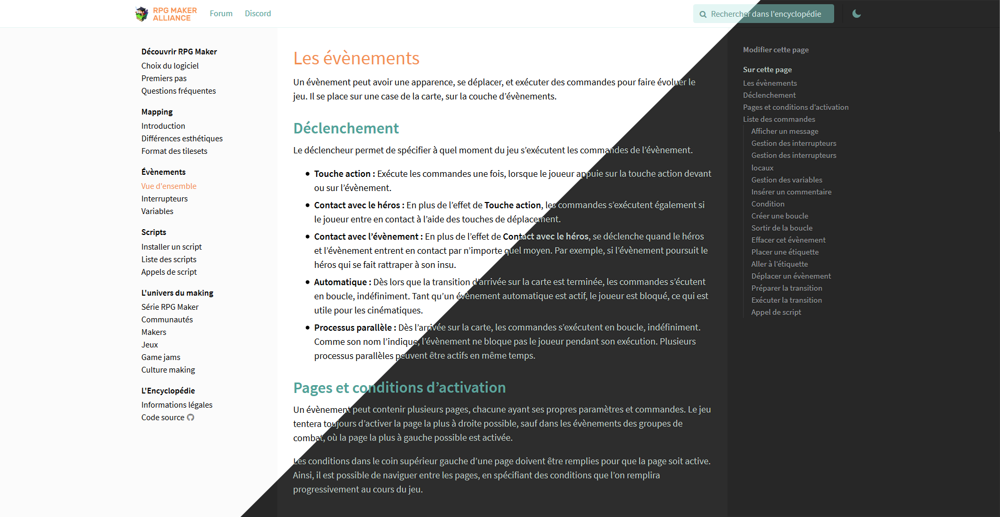

# Royal Theme for Sphinx



This is a [Sphinx](http://www.sphinx-doc.org/en/master/) theme I made for the French RPG Maker community [RPG Maker Alliance (aka RMA)](https://rpgmakeralliance.com). It was designed for more classic and verbose kind of documentations (partly due to being designed for French content).

The theme is semi-responsive as in, it works on every platform (and has a few features specificially made for mobile and tablet) but it has a fixed width both on the sidebars and on the main content in desktop mode

You can see it a live example running at [wiki.rpgmakeralliance.com](https://wiki.rpgmakeralliance.com)

## Installation

### Read The Docs

This theme was not designed to be compatible with ReadTheDocs, as such things like the ReadTheDocs injection WILL break the page layout, the search function doesn't use RTD's and the GitHub links won't be dynamic (thus no support for branches and stuff). You've been warned!

### PyPI

This theme currently has a bunch of hardcoded content and require a few tweaks in `conf.py` to work (see below), until these issues are solved I prefer not uploading the theme to PyPI

### Manual Install

Copy the theme folder to your documentation directory (or anywhere else you like assuming you edit the `html_theme_path` setting accordingly)

Modify your docs `conf.py` file like so :

```py
# Exclude base script files (the theme uses its own)
from sphinx.builders.html import StandaloneHTMLBuilder
StandaloneHTMLBuilder.script_files = []

html_title = 'Your Website Title' # Will be used in addition to the page title for <title>
html_context = {"canonical_url": "https://example.com"} # Your website URL WITHOUT a trailling slash

html_theme = 'royal_theme' # use the theme
html_theme_path = ["."] # search the theme in the current folder
html_experimental_html5_writer = True # use the HTML5 writer
html_add_permalinks = u"" # use font awesome's links
```

Build your project and you should now have a working Sphinx project using this beautiful theme!

#### Optional : Using a custom index

The theme was designed to use a custom index file instead of having a classic Sphinx index with a big table of contents.

First, create an `index.html` file in this format :

```html
<p>Project description</p>
<div id="index-flex-container">
    <section>
        <h4>Section Title</h4>
        <ul>
            <li><a class="reference internal" href="../link/">Page Title</a></li>
            <li><a class="reference internal" href="../link/">Page Title</a></li>
            <li><a class="reference internal" href="../link/">Page Title</a></li>
        </ul>
    </section>

    <section>
        <h4>External Links Section</h4>
        <ul>
            <li><a class="reference external" href="https://example.com">External Link Title</a></li>
            <li><a class="reference external" href="https://github.com">External Link Title</a></li>
        </ul>
    </section>
</div>

```

then create an `index.rst` file to use the `.html` file we just created :

```rst
.. title:: Page Title

My Super Homepage
=================

.. raw:: html
   :file: index.html
```

Build your project and you now have a cool index!

If you're interested in seeing a proper example, you can check out the [index.rst](https://raw.githubusercontent.com/rpgmakeralliance/wiki/master/index.rst) and [index.html](https://raw.githubusercontent.com/rpgmakeralliance/wiki/master/index.html) files the [wiki.rpgmakeralliance.com](https://wiki.rpgmakeralliance.com) project uses

## Hardcoded stuff

In `search.html` at line 26, the line telling the user to activate Javascript to use the search function was manually translated :

```html
<p class="last">
    Merci d'activer JavaScript pour utiliser la recherche.
</p>
```

Here's the original line :

```html
<p class="last">
    Please activate JavaScript to enable the search functionality.
</p>
```
Additionally a few strings in the search are hardcoded in searchtools.js, to get rid of them see [Using Sphinx's own javascript files](#using-sphinxs-own-javascript-files) or replace the file with [Sphinx's](https://github.com/sphinx-doc/sphinx/blob/master/sphinx/themes/basic/static/searchtools.js_t)


In `footer.html` the Last Updated line at line 4 was manually translated :

```jinja
<span class="pull-right">Dernière mise à jour le {{ last_updated }}</span>
```

Here's the original line :

```jinja
<span class="pull-right">Last updated on {{ last_updated }}.</span>
```


### Various content

#### Twitter Metatag

The twitter site metatag (in `_head.html`) is set to the RPG Maker Alliance Twitter


```html
<meta name="twitter:site" content="@rpgalliance" />
```

#### Navigation

The theme navigation (both at the top of the sidebar and in the header) menu are both set directly in the `.html`. In  `layout.html` for the sidebar and `_header.html` for the header (duh)

For the sidebar :
```html
<ul id="sidebar-site-navigation">
    <li><a href="https://rpgmakeralliance.com">Forum</a></li>
    <li><a href="https://discord.gg/RrBppaj">Discord</a></li>
</ul>
```

For the header :

```html
<nav role="navigation" id="header-left" class="pull-left">
    <a href="https://rpgmakeralliance.com">Forum</a>
    <a href="https://discord.gg/RrBppaj">Discord</a>
</nav
```

#### Search placeholders
Both search placeholders are set manually in `layout.html` and `_header.html`

Here in `layout.html` :

```jinja

```

and here in `_header.html`

```jinja

```

We use a different placeholder in the sidebar search (used on mobile platforms) because the full placeholder used in the header doesn't fit in the sidebar

#### Edit this page, on this page and GitHub URL

In the right sidebar, both strings and the GitHub URL are set directly in `layout.html`

The first `#edit-on-github` is for the index page which use a static `index.html` page and the second is for normal pages

```jinja
<nav id="local-sidebar" role="navigation" aria-label="local navigation">
    
        <a id="edit-on-github" href="https://github.com/rpgmakeralliance/wiki/blob/master/index.html">Modifier cette page</a>
    
    
        <a id="edit-on-github" href="https://github.com/rpgmakeralliance/wiki/blob/master/{{ pagename }}.rst">Modifier cette page</a>
        <p class="caption"><span class="caption-text">Sur cette page</span></p>
        <div id="local-toc">{{ toc }}</div>
    
</nav>
```

#### Assets

In `royal_theme/static/assets` three assets are RMA branded, the header logo (`logo.png`), the opengraph/twitter image (`opengraph-icon.png`) and the favicon (`favicon.png`). You most likely want to change these.

In the future I would like to offer settings to change all these settings without having to dig into the templates files directly

## Using Sphinx's own javascript files

If you want to use Sphinx's own JS files, simply remove the first three lines we added in `conf.py` :

```py
# Exclude base script files (the theme can uses its own)
from sphinx.builders.html import StandaloneHTMLBuilder
StandaloneHTMLBuilder.script_files = []
````

Remove these lines in `_layout.html` :

```html
<script src="{{ pathto('_static/js/jquery.min.js', 1) }}"></script>
<script src="{{ pathto('_static/js/underscore.min.js', 1) }}"></script>
<script src="{{ pathto('_static/js/doctools.min.js', 1) }}"></script>
```

and in `search.html` replace

```jinja

```

by

```jinja

```

And, voilà! You now uses the ugly, outdated and somewhat minified files from the base Sphinx theme.

## Licenses

This theme is distributed under the MIT license. You can see the details [here](LICENSE)

## External Resources
- [Dark Mode Icon by Rami McMin](https://www.flaticon.com/free-icon/moon-phase-outline_53381#term=Moon&page=2&position=43)
- [Source Sans Pro font by Adobe](https://fonts.google.com/specimen/Source+Sans+Pro)
- Various icons (menu, permalinks, external links etc) from [Font-Awesome](https://fontawesome.com/) built into a custom bundle using [Fontello](http://fontello.com/)
