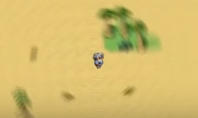
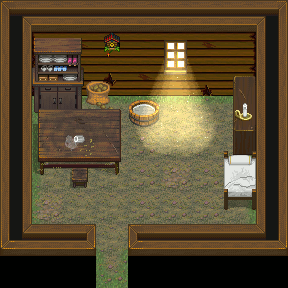

:tocdepth: 3

.. meta::
   :description: Téléchargez des scripts pour ajouter de nouvelles fonctionnalités à vos jeux RPG Maker, sans savoir programmer. Donnez un souffle nouveau à vos jeux grâce aux scripts RME, Fullscreen++, ORMS, et bien d'autres !

Liste des scripts
=================

Cette page recense des scripts de qualité et populaires au sein de la communauté francophone. Ils sont accompagnés d'un manuel clair et ne nécessitent pas de connaissances en programmation pour être utilisés. Pour ajouter un script à votre projet, référez-vous à la section :ref:`installerunscript`.

RPG Maker VX Ace
________________

.. _rme:

RPG Maker Extender
------------------

RME propose une collection d'outils pour favoriser la personnalisation d'un projet RPG Maker. Il est le fruit du travail de plusieurs personnes et toute contribution est la bienvenue.

L'idée reposant derrière RME est d'utiliser la commande :ref:`appeldescript` pour étendre les fonctionnalités offertes par les évènements. Le fait de passer par l'appel de script permet plus de flexibilité dans les commandes, par exemple, le fait de pouvoir passer des variables à la place de tous les arguments.

Liens utiles
~~~~~~~~~~~~

* `Lien direct vers le script <https://raw.githubusercontent.com/RMEx/RME/master/RME.rb>`__
* `Manuel d'utilisation <https://github.com/RMEx/RME/wiki>`__
* `Documentation des commandes <http://rmex.github.io/RMEDoc/>`__
* `Projet sur GitHub <https://github.com/RMEx/RME>`__

.. _orms:

Old RPG Maker Style
-------------------

.. figure:: assets/scripts_orms_donsadventures.png
   :alt: Screenshot de Don's Adventures 2
   :align: right

   Don's Adventures 2 recréé dans VX Ace avec ORMS.

ORMS permet de réaliser un jeu à l'apparence de :ref:`rpgmaker2003` sur :ref:`rpgmakervxace`. De nombreuses options sont configurables, ce qui rend le script très versatile.

ORMS propose de remplacer les polices d'écriture traditionnelles par une image bitmap, afin d'utiliser des polices pixellisées comme celle de RPG Maker 2003. L'affichage des boîtes de dialogue et des choix est également remanié pour imiter l'ancien moteur. En activant les options adéquates

L'intérêt d'ORMS est d'allier le charme pixellisé des jeux RPG Maker 2003 aux potentiel incomparable de RPG Maker VX Ace, afin d'obtenir le meilleur des deux mondes.

Liens utiles
~~~~~~~~~~~~

* `Lien direct vers le script <https://raw.githubusercontent.com/RMEx/orms/master/orms.rb>`__
* `Dernière publication <https://github.com/RMEx/orms/releases>`__
* `Projet sur GitHub et manuel d'utilisation <https://github.com/RMEx/orms>`__

Fullscreen++
------------

Le mode plein écran de RPG Maker VX et VX Ace est connu pour produire des bandes noires ainsi qu'un flou relativement disgracieux. Fullscreen++ apporte un nouveau mode plein écran plus intelligent utilisant toute la surface de l'écran. C'est un atout essentiel afin de rendre son jeu plus crédible aux yeux du grand public, d'une part pour son plein écran plus esthétique, et d'autre part pour ses commandes permettant de réaliser des menus de personnalisation en jeu.

:ref:`fullscreen`

   `Vidéo d'exemple <https://www.youtube.com/watch?v=9yxZOikSKBk>`_

Map Effects
-----------

Ce script pour RPG Maker VX et VX Ace permet d'afficher des effets visuels à l'écran, tels que des flous, des zooms et des distorsions.

:ref:`mapeffects`

RPG Maker XP
____________

AMS Ultimate
------------

AMS Ultimate est un script de Zeus81 pour améliorer considérablement les déplacements. Il améliore le confort de jeu dès l'installation, grâce au déplacement au pixel près et en diagonale. Sa particularité est de repousser les possibilités des mouvements beaucoup plus loin avec de nombreuses options facultatives.

:ref:`amsultimate`

Toutes versions
_______________

Les scripts suivants sont compatibles avec RPG Maker XP, VX et VX Ace. Selon le logiciel utilisé, les scripts peuvent fonctionner légèrement différemment.

.. _lights&shadows:

Zeus Lights & Shadows
---------------------

Ce script permet d'afficher des effets de lumière et d'ombre. La lumière perce l'obscurité de façon réaliste, et l'opacité des ombres décline avec la luminosité. Cela corrige certains comportements étranges du logiciel, notamment les ombres automatiques toujours visibles en pleine nuit. Les ombres de RPG Maker VX et VX Ace sont d'ailleurs gérées par le script, et peuvent être désactivées.

.. figure:: assets/scripts_zeuslightsandshadows_video.png
   :alt: Eclairages nocturnes dans RPG Maker VX Ace
   :align: right

   `Vidéo d'exemple <https://www.youtube.com/watch?v=qkxx3EIopyI>`__

Liens utiles
~~~~~~~~~~~~

* `Lien direct vers le script <http://pastebin.com/raw/VpHHBuaW>`__
* `Manuel d'utilisation <http://pastebin.com/raw/xfu8yG0q>`__
* `Démo pour RPG Maker VX Ace <https://drive.google.com/open?id=1gtIL1nr-8H7Pw5srVFJtnX6Tx9h1p-1Q>`__
* `Démo pour RPG Maker XP <https://drive.google.com/open?id=1yZrQcq3ocIIdY0sJDdYHGZMuASUw9as1>`__

Scroll Pictures
---------------

Scroll Pictures permet d'ajouter des effets visuels localisés pour enrichir les cartes. Il s'adresse aux amateurs des détails les plus fins.

:ref:`scrollpictures`

   La poussière flotte dans la lumière de la fenêtre.
